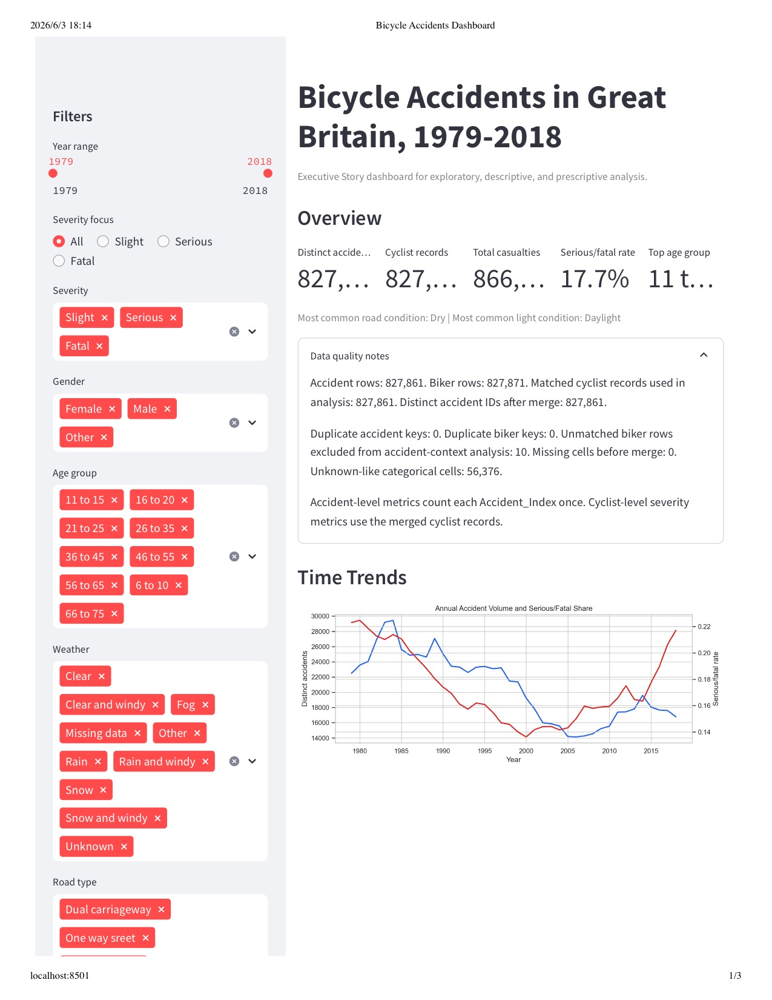

# Bicycle Accidents in Great Britain Dashboard

This folder contains the dashboard-only package for the Bicycle Accidents in Great Britain assignment.

The written report is intentionally not included in this package so it can be submitted separately.

## Included Files

- `app.py`: Streamlit dashboard.
- `src/bike_data.py`: data loading, cleaning, filtering, summary statistics, and recommendations.
- `archive/Accidents.csv`: accident-level source data.
- `archive/Bikers.csv`: cyclist/casualty-level source data.
- `requirements.txt`: Python dependencies.
- `tests/test_bike_data.py`: unit tests for the analysis logic.
- `assets/dashboard_preview.jpg`: static dashboard preview for grading or quick review.
- `assets/Bicycle_Accidents_Dashboard.pdf`: full static dashboard preview exported from the dashboard.

## How To Run The Dashboard

1. Open Terminal.
2. Go to this folder:

```bash
cd Bicycle_Accidents_Dashboard_No_Report
```

3. Install dependencies:

```bash
python3 -m pip install -r requirements.txt
```

4. Start the dashboard:

```bash
python3 -m streamlit run app.py
```

5. Open the local URL shown in Terminal, usually:

```text
http://localhost:8501
```

## What The Dashboard Covers



Full static dashboard preview: [`assets/Bicycle_Accidents_Dashboard.pdf`](assets/Bicycle_Accidents_Dashboard.pdf)

- Overview metrics for matched accident records and cyclist records.
- Data quality notes, including unmatched cyclist rows and unknown-like categorical values.
- Annual trend and monthly seasonality views.
- Severity distribution, gender distribution, and age-group serious/fatal injury shares.
- Road, weather, light, speed-limit, and day/time views.
- Prescriptive recommendations based on meaningful record counts and higher serious/fatal injury shares.
- Interactive filters for year range, severity, gender, age group, weather, road type, and light condition.

## Optional Check

Run the unit tests:

```bash
python3 -m unittest discover -s tests -v
```
